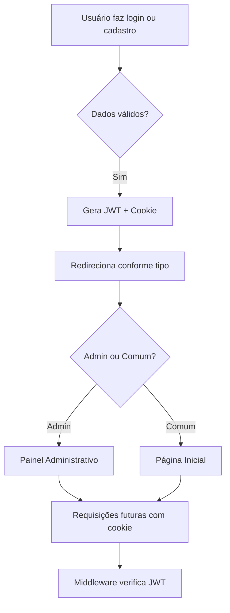

# Sistema de Autenticação e Gestão de Produtos 🔐🚀  
  
  

Um sistema full-stack robusto, com foco em segurança, performance e gestão inteligente de produtos.

## 🧠 Principais Recursos
✔️ Autenticação via **JWT seguro com cookies HTTP-only**  
✔️ Controle de acesso por nível de usuário (**admin / comum**)  
✔️ CRUD de produtos com painel administrativo (somente admin)  
✔️ Interface moderna e responsiva com **TailwindCSS**

---

## 📌 Índice
1. [Objetivo Comercial](#objetivo-comercial)  
2. [Funcionalidades](#funcionalidades)  
3. [Tecnologias Utilizadas](#tecnologias-utilizadas)  
4. [Fluxo de Autenticação](#fluxo-de-autenticação)  
5. [Roadmap](#roadmap)  
6. [Licença](#licença)  

---

## 🎯 Objetivo Comercial
Desenvolvido para resolver problemas reais de **gestão de produtos e autenticação de usuários** em ambientes comerciais digitais.

### 💼 Benefícios para Negócios
- **Automação de Vendas**
  - Cadastro ágil de produtos
  - Controle de estoque e usuários
  - Redução de tarefas manuais em até **40%**

- **Gestão de Conversões**
  - Área administrativa com painel para métricas futuras
  - Segmentação de usuários (comportamento / permissões)
  - Pronto para integrar com **Google Analytics / Meta Pixel**

- **Segurança Corporativa**
  - Criptografia via JWT
  - Cookies protegidos contra roubo
  - **Rate limiting** contra brute-force (5 tentativas / 15min)

---

## ✨ Funcionalidades

### ⚙️ Frontend (React + Tailwind)
- Login, logout e cadastro de usuários
- Rotas protegidas por nível de acesso
- Redirecionamento automático conforme tipo de usuário
- Listagem e criação de produtos (admin)
- Interface responsiva (mobile-first)

### 🔐 Backend (Node.js + Express)
- Autenticação via JWT em cookies HTTP-only
- Middleware de verificação de token
- API RESTful segura e modular
- Banco de dados com MongoDB/Mongoose
- Validação com express-validator
- Rate limiting integrado

---

## 🛠 Tecnologias Utilizadas

| Frontend              | Backend              | Banco de Dados |
|-----------------------|----------------------|----------------|
| React 18              | Node.js              | MongoDB        |
| Vite                  | Express              | Mongoose       |
| TailwindCSS           | JWT                  |                |
| React Router DOM v6   | BcryptJS             |                |
| Axios                 | Express Validator    |                |

---

## 🔐 Fluxo de Autenticação

---

## 🔮 Roadmap (Próximas Etapas)
- [ ] Carrinho de compras inteligente (em desenvolvimento)
- [ ] Integração com gateways de pagamento (Stripe/MercadoPago)
- [ ] Painel de vendas com gráficos em tempo real (D3.js ou Chart.js)
- [ ] Cupom de descontos e promoções
- [ ] Deploy com domínio profissional e CI/CD

---

## 📝 Licença

© 2025 Anthony Garcia Santos — **Todos os direitos reservados.**

Este projeto é disponibilizado **exclusivamente para fins de portfólio pessoal**.

**✔ Permissões**  
- Visualização e análise do código  
- Inspiração para estudos ou reimplementações pessoais  

**❌ Restrições**  
- Proibido uso comercial ou publicação sem autorização  
- Proibida a redistribuição ou modificação deste código  

📬 Para parcerias, propostas ou permissões especiais:  
**anthony.garcia.santos17@gmail.com**

---

## Sobre mim

**Desenvolvido por [Anthony Garcia Santos](https://www.linkedin.com/in/anthony-santos-17820b358/)**  
> "Código seguro, funcional e feito para resolver problemas reais." 💼💡
