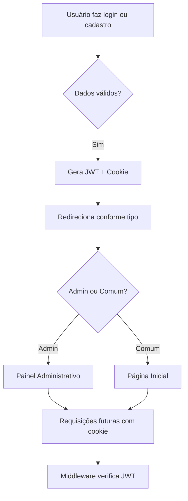

🔽 Want to read in Portuguese? [Click here](#português-versão)  
🔽 Para ver a versão em português, [clique aqui](#portugues-versao)  

<h1 id="top">🔐🚀 Authentication and Product Management System</h1>
#   
#   
#   

description: "A robust full-stack system focused on security, performance, and smart product management."

## 🧠 Key Features
features:
  - "Authentication using secure JWT with HTTP-only cookies"
  - "User access control (admin / regular)"
  - "Product CRUD with admin panel (admin only)"
  - "Modern and responsive interface with TailwindCSS"

## 📌 Index
index:
  - Business Objective
  - Features
  - Technologies Used
  - Authentication Flow
  - Roadmap
  - License

## 🎯 Business Objective
business:
  purpose: "Developed to solve real issues in product management and user authentication in digital business environments."
  benefits:
    - title: "💼 Sales Automation"
      items:
        - "Quick product registration"
        - "Stock and user management"
        - "Reduces manual tasks by up to 40%"
    - title: "📊 Conversion Management"
      items:
        - "Admin dashboard for future metrics"
        - "User segmentation (behavior / permissions)"
        - "Ready for Google Analytics / Meta Pixel integration"
    - title: "🛡 Corporate Security"
      items:
        - "JWT encryption"
        - "Cookies protected against theft"
        - "Rate limiting against brute-force (5 attempts / 15min)"

## ✨ Features
frontend:
  stack: "React + Tailwind"
  items:
    - "Login, logout, and user registration"
    - "Routes protected by access level"
    - "Auto-redirect based on user type"
    - "Product listing and creation (admin only)"
    - "Mobile-first responsive interface"
backend:
  stack: "Node.js + Express"
  items:
    - "Authentication with JWT in HTTP-only cookies"
    - "Token verification middleware"
    - "Secure and modular RESTful API"
    - "Database using MongoDB/Mongoose"
    - "Validation with express-validator"
    - "Integrated rate limiting"

## 🛠 Technologies Used
technologies:
  frontend:
    - React 18
    - Vite
    - TailwindCSS
    - React Router DOM v6
    - Axios
  backend:
    - Node.js
    - Express
    - JWT
    - BcryptJS
    - Express Validator
  database:
    - MongoDB
    - Mongoose

## 🔐 Authentication Flow
auth_flow: |
  graph TD
  A[User logs in or registers] --> B{Valid data?}
  B -- Yes --> C[Generate JWT + Cookie]
  C --> D[Redirect based on user type]
  D --> E{Admin or Regular?}
  E -- Admin --> F[Admin Panel]
  E -- Regular --> G[Home Page]
  F & G --> H[Future requests with cookie]
  H --> I[Middleware checks JWT]

## 🔮 Roadmap (Next Steps)
roadmap:
  - "[ ] Smart shopping cart (in development)"
  - "[ ] Integration with payment gateways (Stripe/MercadoPago)"
  - "[ ] Sales dashboard with real-time charts (D3.js or Chart.js)"
  - "[ ] Discount coupons and promotions"
  - "[ ] Deployment with professional domain and CI/CD"

## 📝 License
license:
  copyright: "© 2025 Anthony Garcia Santos — All rights reserved."
  usage:
    allowed:
      - "Viewing and analyzing the code"
      - "Inspiration for study or personal reimplementation"
    restricted:
      - "Commercial use or publication without permission"
      - "Redistribution or code modification without authorization"
  contact: "anthony.garcia.santos17@gmail.com"

## 🙋 About the Author
author:
  name: "Anthony Garcia Santos"
  linkedin: "https://www.linkedin.com/in/anthony-santos-17820b358/"
  quote: "\"Secure, functional code made to solve real problems.\" 💼💡"

---

---

## Português Versão

# Sistema de Autenticação e Gestão de Produtos 🔐🚀  
  
  

Um sistema full-stack robusto, com foco em segurança, performance e gestão inteligente de produtos.

## 🧠 Principais Recursos
✔️ Autenticação via **JWT seguro com cookies HTTP-only**  
✔️ Controle de acesso por nível de usuário (**admin / comum**)  
✔️ CRUD de produtos com painel administrativo (somente admin)  
✔️ Interface moderna e responsiva com **TailwindCSS**

---

## 📌 Índice
1. [Objetivo Comercial](#objetivo-comercial)  
2. [Funcionalidades](#funcionalidades)  
3. [Tecnologias Utilizadas](#tecnologias-utilizadas)  
4. [Fluxo de Autenticação](#fluxo-de-autenticação)  
5. [Roadmap](#roadmap)  
6. [Licença](#licença)  

---

## 🎯 Objetivo Comercial
Desenvolvido para resolver problemas reais de **gestão de produtos e autenticação de usuários** em ambientes comerciais digitais.

### 💼 Benefícios para Negócios
- **Automação de Vendas**
  - Cadastro ágil de produtos
  - Controle de estoque e usuários
  - Redução de tarefas manuais em até **40%**

- **Gestão de Conversões**
  - Área administrativa com painel para métricas futuras
  - Segmentação de usuários (comportamento / permissões)
  - Pronto para integrar com **Google Analytics / Meta Pixel**

- **Segurança Corporativa**
  - Criptografia via JWT
  - Cookies protegidos contra roubo
  - **Rate limiting** contra brute-force (5 tentativas / 15min)

---

## ✨ Funcionalidades

### ⚙️ Frontend (React + Tailwind)
- Login, logout e cadastro de usuários
- Rotas protegidas por nível de acesso
- Redirecionamento automático conforme tipo de usuário
- Listagem e criação de produtos (admin)
- Interface responsiva (mobile-first)

### 🔐 Backend (Node.js + Express)
- Autenticação via JWT em cookies HTTP-only
- Middleware de verificação de token
- API RESTful segura e modular
- Banco de dados com MongoDB/Mongoose
- Validação com express-validator
- Rate limiting integrado

---

## 🛠 Tecnologias Utilizadas

| Frontend              | Backend              | Banco de Dados |
|-----------------------|----------------------|----------------|
| React 18              | Node.js              | MongoDB        |
| Vite                  | Express              | Mongoose       |
| TailwindCSS           | JWT                  |                |
| React Router DOM v6   | BcryptJS             |                |
| Axios                 | Express Validator    |                |

---

## 🔐 Fluxo de Autenticação

---

## 🔮 Roadmap (Próximas Etapas)
- [ ] Carrinho de compras inteligente (em desenvolvimento)
- [ ] Integração com gateways de pagamento (Stripe/MercadoPago)
- [ ] Painel de vendas com gráficos em tempo real (D3.js ou Chart.js)
- [ ] Cupom de descontos e promoções
- [ ] Deploy com domínio profissional e CI/CD

---

## 📝 Licença

© 2025 Anthony Garcia Santos — **Todos os direitos reservados.**

Este projeto é disponibilizado **exclusivamente para fins de portfólio pessoal**.

**✔ Permissões**  
- Visualização e análise do código  
- Inspiração para estudos ou reimplementações pessoais  

**❌ Restrições**  
- Proibido uso comercial ou publicação sem autorização  
- Proibida a redistribuição ou modificação deste código  

📬 Para parcerias, propostas ou permissões especiais:  
**anthony.garcia.santos17@gmail.com**

---

## 🙋 Sobre o Autor

**Desenvolvido por [Anthony Garcia Santos](https://www.linkedin.com/in/anthony-santos-17820b358/)**  
> "Código seguro, funcional e feito para resolver problemas reais." 💼💡

🔼 [Voltar ao topo / Back to top](#top)

